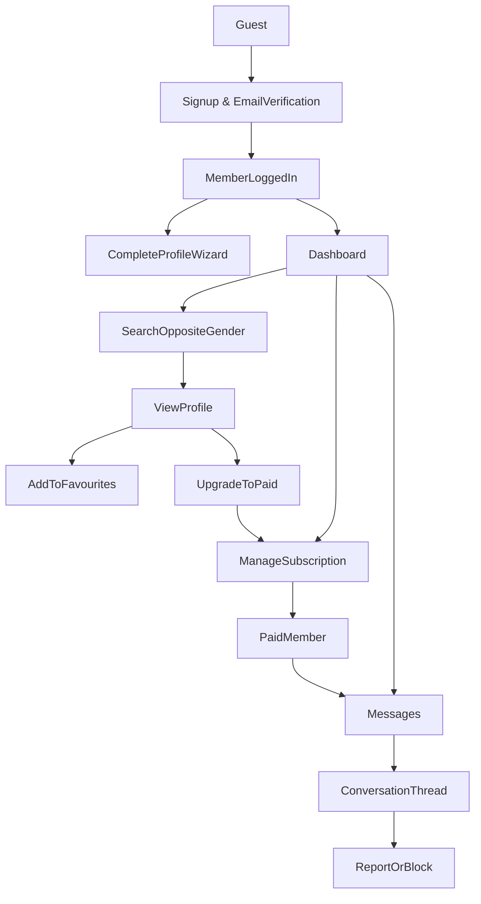

### High-level goals

- **Build a responsive web MVP** that works well on mobile and desktop browsers, focused on halal matchmaking flows.
- **Prioritize simplicity and safety** over advanced features: clear profiles, controlled communication, basic subscriptions, and strong privacy/modesty defaults.
- **Take inspiration from `purematrimony.com` and `sunnahmatch.com`** while keeping scope realistic for a first release.

### Core user roles

- **Guest (unauthenticated)**
  - View marketing/landing pages describing the service, values, and pricing.
  - Start registration and verify email.
  - Read high-level FAQs and safety/Islamic guidelines.
- **Registered member (free)**
  - Complete profile with Islamic and personal criteria.
  - Browse a limited number of profiles (read-only or blurred details).
  - Save basic search filters.
  - Upgrade to paid subscription.
- **Subscribed member (paid)**
  - Full access to search and view profiles within halal boundaries.
  - Initiate and receive messages (within messaging rules).
  - See limited activity indicators (e.g. last active, online recently) respecting privacy.
- **Admin/moderator**
  - Manage users, profiles, reports, and content.
  - Approve or reject suspicious profiles.
  - Configure subscription plans and monitor payments.

### MVP feature set

#### 1. Authentication & onboarding

- **Account creation & login**
  - Email + password auth (with email verification).
  - Basic password reset via email.
- **Onboarding wizard**
  - Multi-step form capturing:
    - Basic info: name (or kunya/alias), gender, age, location, country, nationality.
    - Islamic info: practicing level (self-described), prayer, hijab/beard, madhhab or manhaj (optional), halal relationship expectations.
    - Marital status, children, willingness to relocate.
    - Preferred guardian/mahram involvement option (e.g. contact via wali).
  - Profile photo upload with modesty guidelines and acceptance rules.

#### 2. Profiles & halal constraints

- **User profile**
  - Public profile view (as seen by opposite gender) with:
    - Limited personal identifiers (no direct contact info in profile text).
    - About section, Islamic background, family background, education, profession.
    - Marital preferences and expectations.
  - Privacy controls (MVP level):
    - Show/hide photos to non-subscribers.
    - Option to hide exact age (show range) or city (show country/region only).
- **Profile completeness & status**
  - Profile completeness indicator to encourage filling key fields.
  - Status: pending review, approved, suspended.

#### 3. Search & discovery

- **Search filters (opposite gender only)**
  - Basic: age range, country, city/region, marital status.
  - Islamic/lifestyle: practicing level, sect/creed (optional), hijab/beard, smoking, etc.
  - Other: education level, profession, willingness to relocate.
- **Search results list**
  - Paginated list with thumbnail, age (or range), location, and key Islamic markers.
  - Ability to save a search as a named filter.
- **Browse & shortlist**
  - View profile details from search results.
  - Add/remove profiles from favourites/shortlist.

#### 4. Messaging (within halal guidelines)

- **Conversation model**
  - 1-to-1 text conversations between compatible, opposite-gender members.
  - Optional field to CC wali/guardian email or add them to the conversation in future versions (MVP: just store wali contact info on profile for offline sharing).
- **Messaging rules for MVP**
  - Only paid subscribers can initiate messages.
  - Limit on number of new conversations per day/week to reduce spam.
  - Simple text messages only (no images/attachments in MVP).
  - Basic blocking and reporting within a conversation.
- **Inbox UI**
  - List of conversations with name/alias, last message, timestamp, unread count.
  - Conversation view optimized for mobile.

#### 5. Subscription & payments

- **Plans & access model**
  - Free tier:
    - Create and complete profile.
    - Limited browsing (e.g. limited profile views per day).
    - Cannot initiate messages.
    - Cannot exchange photos.
  - Paid tier:
    - Full profile views (within privacy settings).
    - Ability to initiate and reply to messages.
    - Priority in search results.
    - Advanced search features.
    - Can send request to potential candidate to exchange photos
- **Payment integration (global, simple)**
  - Stripe integration for card payments (global coverage) as primary.
  - Optional PayPal later; MVP can launch with Stripe only.
  - Simple subscription periods: monthly, quarterly, half-yearly and yearly.
  - Option for entering discount codes.
  - Basic billing history and status (active, expired, cancelled).

#### 6. Dashboard & UX

- **Member dashboard**
  - Overview cards: profile completeness, subscription status, new messages, new profile matches.
  - Quick links: edit profile, search, favourites, subscription plans.
- **Notifications (MVP-level)**
  - In-app notification badges for new messages.
  - Email notifications for new messages (with opt-out) and subscription events (renewal, failure, expiry).
- **Global navigation & layout**
  - Mobile-first, responsive design.
  - Simple top nav: Home, Search, Messages, Profile, Account/Settings.

#### 7. Safety, moderation, and Islamic guidelines

- **Content and behaviour guidelines**
  - Dedicated pages for Islamic guidelines, privacy policy, terms of service, safety tips.
  - Enforce no exchange of phone/email/WhatsApp in profile text (basic text checks for obvious contact info patterns).
- **Reporting and blocking**
  - Report profile or conversation with selectable reasons (haram content, harassment, fraud, etc.).
  - Block user: prevents further messaging and hides each other in search.
- **Admin tools (MVP, minimal)**
  - Simple admin panel to:
    - View user list with filters.
    - View and moderate reported users and conversations.
    - Manually change profile status (approve/suspend).
    - View subscription status of user/s.
    - View payment status of user/s.

### Technical recommendations (for MVP)

#### 1. Platform & architecture

- **Frontend**
  - **Framework**: Next.js (latest, App Router) with React and TypeScript, hosted on Vercel.
  - **Styling/UI**: Tailwind CSS plus a light/headless component library (e.g. Headless UI or similar) for dialogs, menus, etc.
- **Backend**
  - Use Next.js as a **full-stack app**:
    - Route Handlers / API routes for JSON APIs (auth, profiles, search, messaging, subscriptions, webhooks).
    - Server components and/or server actions where appropriate for mutations (e.g. profile updates).
  - Authentication and session management via a standard Next.js authentication solution (e.g. Auth.js / NextAuth with credentials provider), using cookie-based sessions backed by the database.
- **Database & storage**
  - **Relational DB**: PostgreSQL, provided by Supabase (managed Postgres).
  - **File storage**: Supabase Storage buckets for profile photos and other user-uploaded media.
  - Aim to keep infrastructure providers minimal: Vercel (app hosting), Supabase (database + storage), Stripe (payments).

#### 2. Key data models (simplified)

The key data models remain as previously defined and map naturally onto PostgreSQL via an ORM like Prisma or Supabase’s SQL APIs:

- **User**: id, email, password hash, role (member/admin), emailVerified, createdAt.
- **Profile**: userId, gender, age, location, Islamic/lifestyle fields, marital status, children, education, profession, bio, waliContact (only for female members), visibility options, status.
- **Photo**: id, profileId, url, isPrimary, isApproved.
- **SubscriptionPlan**: id, name, price, duration, features.
- **Subscription**: userId, planId, status, startDate, endDate, stripeCustomerId, stripeSubscriptionId.
- **MessageThread**: id, participantAId, participantBId, createdAt, lastMessageAt, isBlocked.
- **Message**: threadId, senderId, content, createdAt, isRead.
- **Report**: id, reporterId, reportedUserId or messageThreadId, reason, status.

#### 4. Environments and Stripe modes

- **Opposite-gender interactions only for marriage intent**
  - Enforce opposite-gender matching in search and messaging logic, configurable for specific jurisprudential views later.
- **Guardians/wali concept (simple in MVP)**
  - Store female wali contact details privately on profile. For male members do not need a wali.
  - Provide template messages encouraging involving wali early; later you can add shared conversation access.
- **Modesty and privacy**
  - Clear content rules for photos and text.
  - Easy account deletion and data export if feasible.
- **Environment separation and payments**
  - Use separate configuration for **development/staging** vs **production**.
  - For payments, integrate **Stripe**:
    - Use **Stripe test mode** (sandbox) and test API keys (`sk_test_...`, `pk_test_...`) for all development and trial flows, with test webhooks configured against staging URLs.
    - Only enable real charges in production once ready, by switching to live keys (`sk_live_...`, `pk_live_...`) and configuring live-mode webhooks for the production URL.
  - Keep all secrets (Stripe keys, Supabase keys, etc.) in environment variables managed by Vercel and/or Supabase.

### Phased rollout within the MVP

- **Phase 1 – Core foundation**
  - Authentication, onboarding/profile creation, basic search, profile viewing.
- **Phase 2 – Subscriptions & messaging**
  - Stripe integration, subscription gating, messaging with basic rules.
- **Phase 3 – Moderation & refinement**
  - Reporting/blocking, admin panel, better email notifications, UX polish.

### Non-goals for the first MVP

- Native iOS/Android apps.
- Complex recommendation/AI matching algorithms (stick to filters + simple match suggestions like “people who match your criteria”).
- Advanced real-time features (typing indicators, web sockets) beyond what is necessary for basic messaging.
- Integrations with many regional payment providers.

### Mermaid diagram: simplified user flow

### Next steps

- Finalize and provision the chosen stack: Next.js on Vercel, Supabase for Postgres + storage, and Stripe for subscriptions (with clear test vs live configurations).
- Detail user stories and acceptance criteria for Phase 1 features.
- Sketch low-fidelity wireframes for landing page, dashboard, profile, search, and messaging.
- Set up project repo and initial scaffolding once this plan is approved.

