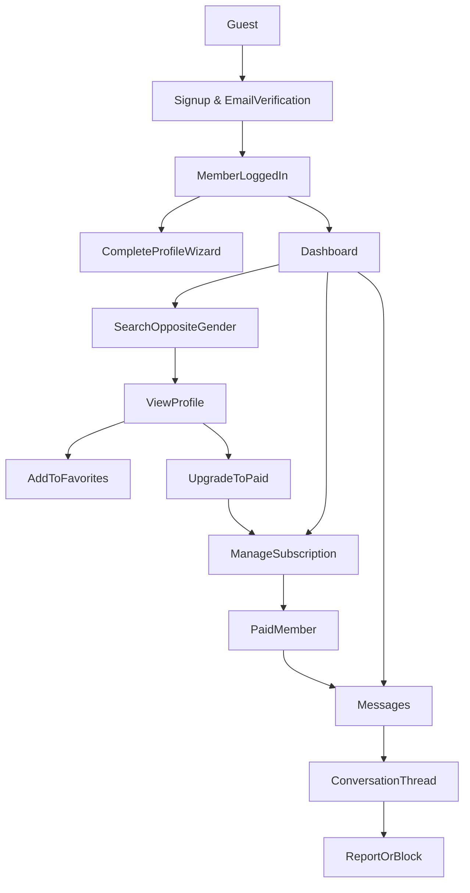

### Implementation snapshot (as of 2026-03-11)

**Admin Panel Improvements Series (Complete ✅):**
- Live stats badges on admin dashboard: Message Queue, Profile Queue, Photo Queue, Reports — all with real-time counts from DB, each card links to the corresponding queue page.
- Flagged Users page at `/admin/flagged`: rows colour-coded GREEN / AMBER / RED by risk label; inline Resolve and Resolve + Suspend actions; Suspend action hidden for already-suspended users.
- Reject + Warn persistence: rejected messages now atomically create a `ModerationWarning` DB record (recipientId, issuerId, messageId, content); minimum 5-character validation; separate Reject and Reject + Warn buttons in the moderation queue UI.
- Seed data consistency: all completed profiles have mandatory onboarding fields filled; message threads are opposite-gender only (Islamic rule enforced in seed).
- 197 tests total (26 suites) passing.

**Phase 3 - Admin Auth Hardening (Complete ✅):**
- Split login portals fully implemented and tested (members → `/auth/login`, admins/moderators → `/admin/login`).
- Admin login isolated from the protected admin layout tree (moved to `(public)` route group) — eliminates redirect loop for unauthenticated admins.
- Wrong-portal logins rejected with corrective error messages directing users to the correct URL.
- Admin shell logout action replaces the previous "Back to Site" link — uses same icon/pattern as the member logout.
- `MODERATOR` enum value synced to live database; moderator credentials and `ModeratorPermissionConfig` seeded.
- 15 new tests added covering split login route handlers and auth utility functions (4+4+4+3).
- Docs updated: README portal guidance, `SEED_DATA_REFERENCE.md` credentials, `PLAN.md` snapshot.

**Phase 1 - Core Features:**
- Favorites flow is implemented end-to-end:
  - Toggle add/remove from search results and the favorites page.
  - Star icon reflects state (outlined when not favorited, solid green when favorited).
  - Favorites page reuses search-style result cards and supports direct removal.
  - Profile detail back link is context-aware (`Back to favorites` when opened from favorites).
- Phase 1 API and action testing coverage has been expanded beyond register-only.
- Authentication now uses split login portals:
  - Members sign in at `/auth/login`.
  - Admins and moderators sign in at `/admin/login`.
  - Wrong-portal logins are rejected with corrective guidance instead of creating a session.
- Admin login route is isolated from the protected admin layout tree to avoid redirect loops.
- Admin shell now uses an explicit logout action instead of a back-to-site link.
- Local hooks are active:
  - Pre-commit: staged lint checks.
  - Pre-push: typecheck and API tests.

**Phase 2 - Messaging (Phase 2 Implementation Complete ✅):**
- Real-time messaging with Server-Sent Events (SSE) for instant delivery without page refresh
- Subscription-based conversation initiation (at least one party must have premium subscription)
- Shariah-compliant content moderation with pattern-based filtering (bad-words library + custom regexes)
- Pre-moderation workflow: flagged messages held in queue for admin review before delivery
- Message pagination: loads 10 latest messages initially, then 5 older on upscroll for efficient browsing
- Message status indicators: "Sent", "Under Review" (for flagged), "Delivered", "Read"
- Real-time inbox synchronization: threads move to top, unread counter updates without refresh
- Admin moderation interface at `/admin/moderation` to review and approve/reject flagged messages ("Message Queue" link in admin nav)
- **Reject + Warn** action persists a `ModerationWarning` record (DB table) linked to the message sender, issuing admin, and rejected message; minimum 5-character validation enforced
- Separate **Reject** (no notification) and **Reject + Warn** buttons replace the previous single-button-plus-prompt pattern
- Female-only wali reminder in chat interface (checks for FEMALE gender enum value)
- Send Message button on profile view with subscription validation and link to pricing
- WhatsApp-style timestamps (time for today, "Yesterday", day name within 7 days, date for older)
- Enter-to-send with Shift+Enter for newline, 2000 character limit, no page refresh
- Fixed 600px chat window with scrollbar and scroll position preservation on older-message load
- Auto-thread selection from query param with textarea auto-focus on navigation from profile
- Message thread creation with bidirectional lookup (prevents duplicate threads)
- Admin-only moderation dashboard with context view, approval/rejection, and warning notifications
- Unread counter badge in navigation header with real-time updates
- Empty state handling (no "Loading..." for truly empty conversations)
- 15 message action tests + 14 admin moderation tests passing with comprehensive coverage
- Fixed message ordering bug: added secondary sort by ID for deterministic ordering even with identical timestamps

### High-level goals

- **Build a responsive web MVP** that works well on mobile and desktop browsers, focused on halal matchmaking flows.
- **Prioritize simplicity and safety** over advanced features: clear profiles, controlled communication, basic subscriptions, and strong privacy/modesty defaults.
- **Take inspiration from `purematrimony.com` and `sunnahmatch.com`** while keeping scope realistic for a first release.

### Core user roles

- **Guest (unauthenticated)**
  - View marketing/landing pages describing the service, values, and pricing.
  - Start registration and verify email.
  - Read high-level FAQs and safety/Islamic guidelines.
- **Registered member (free)**
  - Complete profile with Islamic and personal criteria.
  - Browse a limited number of profiles (read-only or blurred details).
  - Save basic search filters.
  - Upgrade to paid subscription.
- **Subscribed member (paid)**
  - Full access to search and view profiles within halal boundaries.
  - Initiate and receive messages (within messaging rules).
  - See limited activity indicators (e.g. last active, online recently) respecting privacy.
- **Admin/moderator**
  - Manage users, profiles, reports, and content.
  - Approve or reject suspicious profiles.
  - Configure subscription plans and monitor payments.

### MVP feature set

#### 1. Authentication & onboarding

- **Account creation & login**
  - Email + password auth (with email verification).
  - Basic password reset via email.
- **Onboarding wizard** (mandatory, multi-step, async auto-save per step, resume-capable)
  - Single-route, component-based wizard at `/onboarding` with 5 steps + completion flow.
  - **Hard gate**: Profile completion required before accessing `/search`, `/messages`, `/dashboard`; incomplete profiles redirect to `/onboarding`.
  - **Gender-specific validation rules**:
    - **Minimum age**: 14 years (both genders); younger users blocked with "You must be at least 14 years old to join."
    - **Female**: Cannot sign up if marital status = "married"; profile creation rejected with "AlHarmony is for single sisters..." error. Must provide Wali (guardian) contact: name, email, phone (stored privately, never shown publicly).
    - **Male**: Can be married and seek second wife; Wali not required.
  - **Five-step form** with async auto-save and resume on re-login (resume from last uncompleted step):
    - **Step 1 – Basic Info** (mandatory): Full name, gender (immutable after selection), DOB/age (validates 14+), nationality, country, city (optional), ethnicity (optional).
    - **Step 2 – Islamic Details** (mandatory): Practicing level, prayer frequency, height, weight (optional), body shape, hijab/beard style (gender-specific UI), Sunni madhab.
    - **Step 3 – Marital & Family** (mandatory): Marital status (gender-specific dropdown; female married status blocked at submission), children count (0–10), children living with user (conditional), relocation willingness (yes/maybe/no) + optional notes.
    - **Step 4 – Preferences** (mandatory): Spouse status preferences (gender-specific checkboxes; at least 1 required).
      - Female seeking: Virgin, Divorced, Annulled.
      - Male seeking: Virgin, Married (second wife), Separated.
    - **Step 5 – Wali Info** (mandatory for female; summary review for male):
      - **Female**: Wali name, relationship (Father/Brother/Uncle/Grandfather/Imam/Other), email (validated), phone (validated). Privacy notice: "This info is private and never shown publicly."
      - **Male**: Read-only summary review of Steps 1–4; no wali fields required.
  - **UI/UX**:
    - Progress bar showing step number and percentage.
    - Previous/Next buttons with validation blocking progression on invalid data.
    - "Save & Exit" allows users to leave mid-wizard and resume later.
    - Blocking error messages for rejected states (e.g., married female, age < 14).
    - Congratulations page after Step 5 with next-step guidance.
  - **Async save mechanism**: Each step saves independently server-side; users can return to incomplete wizards and resume from last completed step.
  - Upon final Step 5 submission: `onboardingCompletedAt` timestamp recorded in database and profile status set to `PENDING_REVIEW` (admin approval required before appearing in search).
  - Post-wizard: Optional profile photo upload step with blurred display rules.

#### 2. Profiles & halal constraints

- **User profile**
  - Public profile view (as seen by opposite gender) with:
    - Limited personal identifiers (no direct contact info in profile text).
    - About section, Islamic background, family background, education, profession.
    - Marital preferences and expectations.
  - Privacy controls (MVP level):
    - Show/hide photos to non-subscribers.
    - Option to hide exact age (show range) or city (show country/region only).
- **Profile completeness & status**
  - Profile completeness indicator to encourage filling key fields.
  - **Completeness Calculation**: Percentage based on total (mandatory + optional) fields filled.
    - **Mandatory fields** (~12-15 depending on gender):
      - Alias, Gender, Location (city/country), Date of birth
      - Practicing level, Prayer habit, Body shape, Hijab/Beard preference
      - Marital status, Number of children, Spouse status preferences
      - Wali info for females (name, relationship, contact)
    - **Optional fields** (~5):
      - About/Bio, Photos, Education, Profession, Madhab/Religious school
    - **Formula**: `(completed_fields / total_fields) × 100%`
    - Example: If 13 fields completed out of 17 total, percentage = 76%
  - Status: pending review, approved, suspended.

#### 3. Search & discovery

- **Search filters (opposite gender only)**
  - Basic: age range, country, city/region, marital status.
  - Islamic/lifestyle: practicing level, sect/creed (optional), hijab/beard, smoking, etc.
  - Other: education level, profession, willingness to relocate.
- **Search results list**
  - Paginated list with thumbnail, age (or range), location, and key Islamic markers.
  - Ability to save a search as a named filter.
- **Browse & shortlist**
  - View profile details from search results.
  - Add/remove profiles from favorites/shortlist.

#### 4. Messaging (within halal guidelines)

- **Conversation model**
  - 1-to-1 text conversations between compatible, opposite-gender members.
  - Real-time updates using Server-Sent Events (SSE) for instant message delivery without page refresh.
  - Message threads tracked with last message timestamp, unread count, and moderation status.
  - Optional field to CC wali/guardian email or add them to the conversation in future versions (MVP: just store wali contact info on profile for offline sharing).
- **Subscription-based initiation**
  - **At least one party must have an active subscription** to start a conversation:
    - Subscribed user (male or female) can initiate conversation with any compatible match.
    - Free user can only respond if a subscribed user initiates first.
    - Clear error messaging when free user attempts to initiate: "Subscription required to start conversations."
  - Once conversation is initiated, both parties can send/receive messages regardless of who paid.
- **Content moderation for Shariah compliance**
  - **Configurable moderation system**:
    - **Type**: Pattern-based (MVP) or AI/NLP (future, interface ready).
    - **Workflow**: Pre-moderation (default) or Post-moderation (admin configurable).
  - **Pattern-based detection** (MVP implementation):
    - Profanity filtering using `bad-words` or `leo-profanity` library.
    - Custom regex patterns for Islamic modesty violations (sexual advances, inappropriate content).
    - Keyword lists for English and transliterated Arabic terms.
  - **Pre-moderation workflow** (default):
    - Flagged messages held in pending state, not delivered to recipient.
    - Sender sees "Message under review" indicator.
    - Subsequent messages in same thread queued to preserve chronological order.
    - Admin reviews, approves or rejects with optional warning.
  - **Post-moderation workflow** (optional, admin toggle):
    - Flagged messages delivered immediately but marked for review.
    - Admin reviews after delivery, can send warnings or take action on repeat offenders.
  - **Admin moderation interface**:
    - Dashboard at `/admin/moderation` to review pending messages.
    - Settings page at `/admin/moderation/settings` to configure moderation type and workflow.
    - View full thread context, flagged reason, and conversation history.
    - Actions: Approve, Reject + Warn User, Block Thread.
- **Real-time messaging features**
  - **Instant delivery**: Messages appear within ~5 seconds without page refresh (SSE polling interval).
  - **Unread counter**: Badge on Messages navigation link shows unread count, updates in real-time.
  - **Message status indicators**:
    - "Sent" - message delivered successfully.
    - "Under Review" - message flagged and pending admin approval (pre-moderation mode).
    - "Delivered" - message appears to recipient (clean or post-moderation mode).
  - **Conversation interface**:
    - Inbox list showing all conversations sorted by last message time.
    - Click conversation to open chat view with message bubbles.
    - Send message with text input and send button.
    - Filter conversations: All / Unread / Favorited.
- **Messaging rules for MVP**
  - Simple text messages only (no images/attachments in MVP - planned for future).
  - Basic blocking within a conversation (schema ready, UI in future version).
  - Reporting conversations for inappropriate content.
  - Limit on number of new conversations per day/week to reduce spam (future consideration).
- **Inbox UI**
  - List of conversations with participant name/alias, last message preview, timestamp, unread badge.
  - Real-time updates when new messages arrive (thread moves to top, unread count increments).
  - Conversation view optimized for mobile and desktop.
  - "Start New Conversation" button opens modal to select recipient from favorites or search.
- **Technical implementation**
  - Server-Sent Events (SSE) for real-time updates (browser-native, works on all platforms).
  - Database polling every 5 seconds for new messages (balance between real-time feel and server load).
  - Moderation configuration stored in database, changeable via admin UI without code deploy.
  - Comprehensive unit tests for subscription gating, content moderation, and message delivery.
- **Future enhancements** (see todos):
  - Read receipts and "seen by" indicators.
  - Typing indicators.
  - Message editing/deletion.
  - File and image attachments with Islamic modesty filters.
  - Advanced AI-based content moderation.
  - Email notifications for new messages.
  - Block/mute UI.
  - Message search and filtering.
  - Wali visibility into conversations.
  - Performance optimizations (SSE tab sharing, Prisma Pulse, microservice architecture).

#### 5. Subscription & payments

- **Plans & access model**
  - Free tier:
    - Create and complete profile.
    - Limited browsing (e.g. limited profile views per day).
    - Cannot initiate messages.
    - Cannot exchange photos.
  - Paid tier:
    - Full profile views (within privacy settings).
    - Ability to initiate and reply to messages.
    - Priority in search results.
    - Advanced search features.
    - Can send request to potential candidate to exchange photos
- **Payment integration (global, simple)**
  - Stripe integration for card payments (global coverage) as primary.
  - Optional PayPal later; MVP can launch with Stripe only.
  - Simple subscription periods: monthly, quarterly, half-yearly and yearly.
  - Option for entering discount codes.
  - Basic billing history and status (active, expired, cancelled).

#### 6. Dashboard & UX

- **Member dashboard** (`/dashboard`)
  - **Overview cards**:
    - Profile completeness (with progress bar showing % and field counts: X/Y fields completed)
    - Subscription status (Free/Premium/Expired with conditional upgrade button)
    - Messages (unread conversations count, total active threads)
    - Profiles to explore (available opposite-gender profile count)
  - **Quick action buttons**: Edit profile, Start search, Favorites, Manage subscription
  - **Dynamic content**: All data fetched from database; greeting personalized with user's alias or name; member-since date from account creation
  - **API endpoint**: `GET /api/dashboard` (authenticated, returns dashboard data with completeness breakdown)
- **Notifications (MVP-level)**
  - In-app notification badges for new messages.
  - Email notifications for new messages (with opt-out) and subscription events (renewal, failure, expiry).
- **Global navigation & layout**
  - Mobile-first, responsive design.
  - Simple top nav: Home, Search, Messages, Profile, Account/Settings.

#### 7. Safety, moderation, and Islamic guidelines

- **Content and behaviour guidelines**
  - Dedicated pages for Islamic guidelines, privacy policy, terms of service, safety tips.
  - Enforce no exchange of phone/email/WhatsApp in profile text (basic text checks for obvious contact info patterns).
- **Reporting and blocking**
  - Report profile or conversation with selectable reasons (haram content, harassment, fraud, etc.).
  - Block user: prevents further messaging and hides each other in search.
- **Admin tools (MVP, minimal)**
  - Simple admin panel to:
    - View user list with filters.
    - View and moderate reported users and conversations.
    - Manually change profile status (approve/suspend).
    - View subscription status of user/s.
    - View payment status of user/s.

### Technical recommendations (for MVP)

#### 1. Platform & architecture

- **Frontend**
  - **Framework**: Next.js (latest, App Router) with React and TypeScript, hosted on Vercel.
  - **Styling/UI**: Tailwind CSS plus a light/headless component library (e.g. Headless UI or similar) for dialogs, menus, etc.
- **Backend**
  - Use Next.js as a **full-stack app**:
    - Route Handlers / API routes for JSON APIs (auth, profiles, search, messaging, subscriptions, webhooks).
    - Server components and/or server actions where appropriate for mutations (e.g. profile updates).
  - Authentication and session management via a standard Next.js authentication solution (e.g. Auth.js / NextAuth with credentials provider), using cookie-based sessions backed by the database.
- **Database & storage**
  - **Relational DB**: PostgreSQL, provided by Supabase (managed Postgres).
  - **File storage**: Supabase Storage buckets for profile photos and other user-uploaded media.
  - Aim to keep infrastructure providers minimal: Vercel (app hosting), Supabase (database + storage), Stripe (payments).

#### 2. Key data models (simplified)

The key data models remain as previously defined and map naturally onto PostgreSQL via an ORM like Prisma or Supabase’s SQL APIs:

- **User**: id, email, password hash, role (member/admin), emailVerified, createdAt.
- **Profile**: userId, gender, fullName, dateOfBirth, age-derived fields, country, city, region, nationality, ethnicity; practicing level, prayer habit, height, weight, body shape, hijab/beard, madhab; marital status, number of children, children living with user, willing to relocate with notes; spouse status preferences (JSON), wali contact info (name, relationship, email, phone—private for females); visibility settings, profile status (pending_review/approved/suspended), onboardingCompletedAt (nullable; null = incomplete, set on wizard completion).
- **Photo**: id, profileId, url, isPrimary, isApproved (for blur/unblur logic).
- **SubscriptionPlan**: id, name, price, duration, features.
- **Subscription**: userId, planId, status, startDate, endDate, stripeCustomerId, stripeSubscriptionId.
- **MessageThread**: id, participantAId, participantBId, createdAt, lastMessageAt, isBlocked.
- **Message**: threadId, senderId, content, createdAt, isRead.
- **Report**: id, reporterId, reportedUserId or messageThreadId, reason, status.

#### 4. Environments and Stripe modes

- **Opposite-gender interactions only for marriage intent**
  - Enforce opposite-gender matching in search and messaging logic, configurable for specific jurisprudential views later.
- **Guardians/wali concept (simple in MVP)**
  - Store female wali contact details privately on profile. For male members do not need a wali.
  - Provide template messages encouraging involving wali early; later you can add shared conversation access.
- **Modesty and privacy**
  - Clear content rules for photos and text.
  - Easy account deletion and data export if feasible.
- **Environment separation and payments**
  - Use separate configuration for **development/staging** vs **production**.
  - For payments, integrate **Stripe**:
    - Use **Stripe test mode** (sandbox) and test API keys (`sk_test_...`, `pk_test_...`) for all development and trial flows, with test webhooks configured against staging URLs.
    - Only enable real charges in production once ready, by switching to live keys (`sk_live_...`, `pk_live_...`) and configuring live-mode webhooks for the production URL.
  - Keep all secrets (Stripe keys, Supabase keys, etc.) in environment variables managed by Vercel and/or Supabase.

### Phased rollout within the MVP

- **Phase 1 – Core foundation**
  - Authentication, onboarding/profile creation, basic search, profile viewing.
- **Phase 2 – Subscriptions & messaging**
  - Stripe integration, subscription gating, messaging with basic rules.
- **Phase 3 – Moderation & refinement**
  - Reporting/blocking, admin panel, better email notifications, UX polish.

### Non-goals for the first MVP

- Native iOS/Android apps.
- Complex recommendation/AI matching algorithms (stick to filters + simple match suggestions like “people who match your criteria”).
- Advanced real-time features (typing indicators, web sockets) beyond what is necessary for basic messaging.
- Integrations with many regional payment providers.

### Mermaid diagram: simplified user flow

### Phase 1 – Testing & Quality Gates

To prevent regressions before pushing to `master`, maintain lightweight local checks with route-level tests and hook-based enforcement.

#### Objectives

- Fast, deterministic route handler and server action tests using Jest with mocked dependencies.
- Local git hooks:
  - Pre-commit: staged lint checks (`lint-staged`).
  - Pre-push: `npm run typecheck` + `npm run test:api`.
- Keep execution time low for fast developer feedback.
- Use deploy-time validation in Vercel; defer GitHub Actions CI to Phase 2.

#### Current Phase 1 Coverage

**Route and action coverage currently includes:**

1. **Register API** (`/api/auth/register`) success/validation/duplicate/error paths
2. **Favorites API** (`/api/favorites`) GET/POST auth, validation, and error paths
3. **Dashboard API** (`/api/dashboard`) data shaping and access checks
4. **Search APIs** list/detail route behavior and filtering checks
5. **Profile photos API** validation and constraints
6. **Favorites server actions** toggle logic, business rules, and filtering

**Mocking strategy**:

- Mock `@/lib/prisma` client for database isolation
- Mock auth/session and utility dependencies as needed (`next-auth`, `@/auth`, `bcryptjs`)
- Use synthetic `Request` objects (no real HTTP server)

#### Enforcement and Workflow

1. **Run staged lint at commit time**:

- `.husky/pre-commit` runs `npm run precommit:staged`
- `lint-staged` runs ESLint autofix for staged JS/TS files

2. **Run core checks at push time**:

- `.husky/pre-push` runs `npm run typecheck` and `npm run test:api` in parallel

3. **Keep test suites focused and deterministic**:

- API route tests under `tests/api/`
- Server action tests under `tests/actions/`
- Use mocked dependencies and direct handler/action invocation

4. **Document test commands and hook behavior**:

- Keep README testing section aligned with scripts and hook behavior

#### Verification Checklist

- [x] `npm run test:api` passes locally
- [x] `npm run lint` and `npm run typecheck` pass locally
- [x] Breaking API tests blocks `git push` via pre-push hook
- [x] Type errors block `git push` via pre-push hook
- [x] Staged lint checks run during commit via pre-commit hook
- [x] `npm run test:watch` available for fast local feedback

#### Phase 2 – Deferred Items

- **Stripe checkout tests**: Add tests for `app/api/stripe/checkout/route.ts` (happy path + error cases, mocked Stripe SDK)
- **GitHub Actions workflow**: Add CI pipeline for PR quality checks if branch protection or team collaboration requires remote enforcement
- **Vercel test integration**: Optionally add `&& npm run test:api` to Vercel build command (via dashboard or `vercel.json`) to block deployments on test failures

#### Design Decisions

- **Test runner**: Jest (mature ecosystem, good TypeScript support)
- **Pre-push gates**: API tests + typecheck only (no build for speed)
- **Coverage depth**: Happy path + key failure modes (not exhaustive edge cases in Phase 1)
- **Mocking approach**: Full isolation via mocked Prisma/bcrypt for speed and determinism
- **Vercel integration**: Optional; Vercel's default build validation catches build failures, tests can be added later if needed

### Next steps

- Finalize and provision the chosen stack: Next.js on Vercel, Supabase for Postgres + storage, and Stripe for subscriptions (with clear test vs live configurations).
- Detail user stories and acceptance criteria for Phase 1 features.
- Sketch low-fidelity wireframes for landing page, dashboard, profile, search, and messaging.
- Set up project repo and initial scaffolding once this plan is approved.
